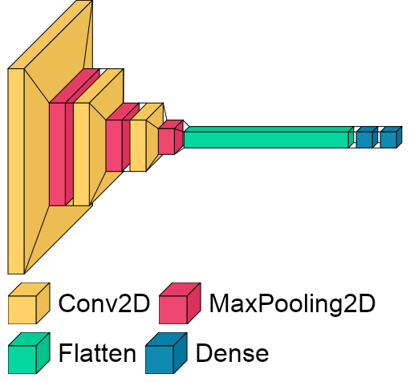

# Tomato Disease Classification
The aim of this project is to classify tomato diseases based on their leaves that can be very useful in the agriculture. To be more user-friendly, a simple GUI has been created so that users can interact with the App to upload the images of their tomato leaves and find the diseases. This App can find healthy tomatoes and 9 different diseases.

---
## Table of Contents
- [Requirements](#requirements)
- [How to Run](#how-to-run)
- [Data and the Code](#data-and-the-code)
- [CNN Architecture](#cnn-architecture)
- [App Usage Example](#app-usage)
---
## Requirements
This project requires [Python3.8](https://www.python.org/downloads/release/python-380/) and the following Python libraries installed:
- [NumPy](https://numpy.org/)
- [matplotlib](https://matplotlib.org/)
- [tensorflow](https://www.tensorflow.org/)
- [opencv](https://opencv.org/)

Instead of manually installing the libraries, you can install all of them with `requirements.txt`. Here is how it works:<br />
```bash
pip install -r requirements.txt
```
Since all the code has been written in [Jupyter Notebook](http://jupyter.org/install.html), you also need that to be installed on your computer.
If you do not have Python installed yet, you can install the [Anaconda](https://www.anaconda.com/download/) distribution of Python, which is already coming with NumPy and Matplotlib installed.
If you do not have pip installed, you can run the code below in the terminal or command window
- For Linux / MacOS
```bash
python get-pip.py
```
- For Windows
```bash
C:> py get-pip.py
```

## How to Run
After installing all the libraries properly, go through `modelling.ipynb` and run cells to train the model.
```

## Data and the Code
[Kaggle Tomato leaves data](https://www.kaggle.com/kaustubhb999/tomatoleaf) has been used for this project. In total we have 10 categories: 9 diseases and healthy tomatoes.For each category, there are 10k images to train and 1k images to test our model. All the images have been resized by 64x64 before uploading to the workspace to reduce the size of zip folder containing the images. <br />The project contains 2 notebooks: <br />
* `Tomato Disease Classification - GUI.ipynb` - for reading and processing the images and training our model <br />
* `Tomato Disease Classification - Modelling.ipynb` - for creating user interface so that users can upload tomato leaf images (allowed file formats: jpg, jpeg, png, bmp) and use predict button to see the diseases their tomatoes have

## CNN Architecture
Our CNN architecture consist of 3 feature extraction blocks (each has Conv2D layer with ReLU activation followed by MaxPooling layer) and a heading with Flatten and Dense layer(40 units) followed by softmax activation. Here is the visual intepretation of our architecture:<br />
<p align="center">
  
</p>
